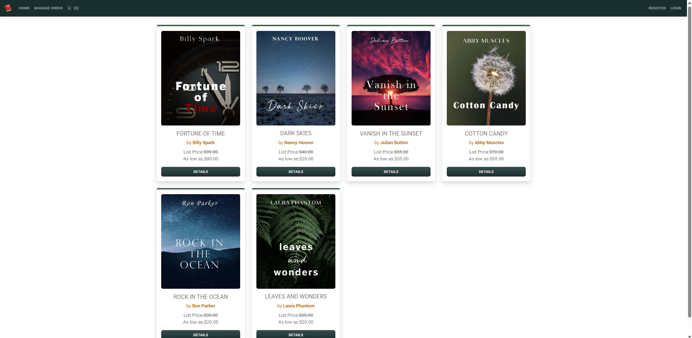

# Bookstore Website

This is a full-stack e-Commerce bookstore website built using ASP.NET Core MVC and Razor Pages. It allows users to browse books, manage orders, and securely complete payments using Stripe. The website is deployed on Microsoft Azure.

## Features
- Book catalog with filtering and sorting options
- User authentication and role management
- Shopping cart and order management system
- Secure payment integration with Stripe
- Admin panel for managing books and orders

## Tech Stack
- **Frontend:** Razor Pages, Bootstrap, jQuery
- **Backend:** ASP.NET Core MVC, C#
- **Database:** Entity Framework Core with SQL Server
- **Authentication:** ASP.NET Core Identity
- **Payment Integration:** Stripe
- **Deployment:** Microsoft Azure

 **Sample Preview of Website** - https://bulkymvc-rithvij-e5dbd4htdhcybphv.canadacentral-01.azurewebsites.net/
 
